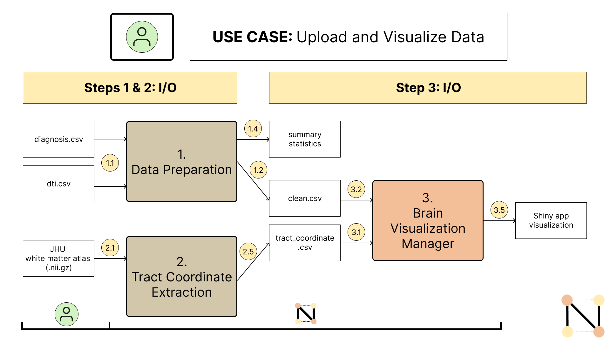
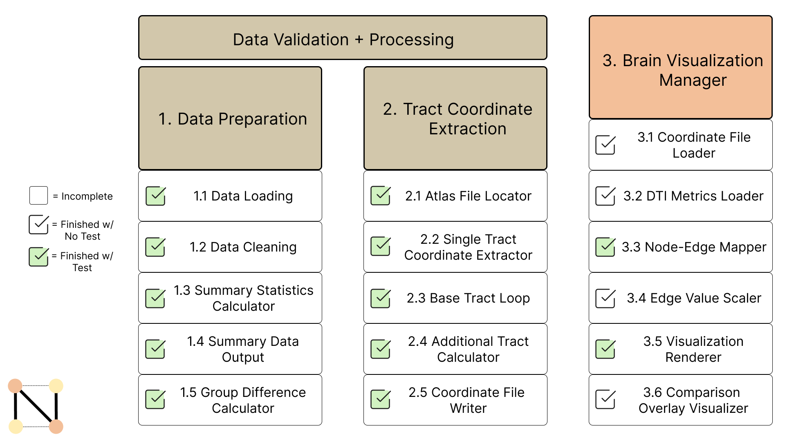

# NeuroConnect  
**Interactive 3D visualization tool for exploring white matter tract connectivity patterns in Alzheimer's disease**

[](https://www.python.org/)
[](LICENSE)
[]()

---

## 🧠 Try It Now

**Live Demo:** https://cpineda.shinyapps.io/neuroconnect/

Experience NeuroConnect directly in your browser - no installation required!

---

## Table of Contents

- [Overview](#overview)
- [Intended Audience](#intended-audience)
- [Features](#features)
- [Installation](#installation)
- [Quick Start Guide](#quick-start-guide)
- [Data](#data)
- [Project Structure](#project-structure)
- [Workflow](#workflow)
- [Examples](#examples)
- [Development Status](#development-status)
- [Testing](#testing)
- [Team & Contributions](#team--contributions)
- [Documentation](#documentation)
- [License](#license)

---

## Overview

NeuroConnect is an interactive neuroimaging visualization app built using **Shiny for Python** and **Plotly 3D**. The tool makes neuroimaging data accessible without requiring specialized software or programming expertise.

The tool processes diffusion tensor imaging (DTI) data from the Alzheimer's Disease Neuroimaging Initiative (ADNI) and renders 52 white matter tracts in standardized MNI space, enabling researchers, educators, and students to explore structural brain connectivity patterns.

This repository follows software engineering best practices with **unit tests**, **CI workflows**, and **comprehensive documentation**.

---

## Intended Audience

NeuroConnect is designed for:

**Educators & Students**
- Neuroscience instructors teaching neuroanatomy and brain connectivity
- Students learning about neuroimaging methods without programming barriers

**Researchers**
- Cognitive neuroscientists studying aging and dementia
- Neuroimaging specialists validating preprocessing pipelines

**Science Communicators**
- Science writers and journalists creating visuals for general audiences

### Background Required

- **Minimal**: Basic understanding of brain anatomy
- **Helpful**: Familiarity with neuroimaging concepts (not required)
- **Not Required**: Programming experience or specialized neuroimaging software

---

## Features

### Visualization

- **Interactive 3D brain models**: Rotate, zoom, and pan to explore 52 white matter tracts (48 JHU base tracts + 4 composite regions)
- **Multi-group comparison**: Side-by-side visualization of healthy controls (CN) vs. Alzheimer's disease (AD)
- **Tract integrity metrics**: Color-coded by Fractional Anisotropy (FA) to visualize white matter health
- **Difference mapping**: Highlight structural changes between diagnostic groups
- **Individual tract highlighting**: 3D spheres mark tract endpoints for detailed exploration

### Data & Export

- **Demo data included**: Pre-loaded CN and AD datasets for immediate exploration
- **Custom data upload**: Support for user-provided DTI datasets
- **Export functionality**: Save high-quality visualizations for presentations and publications

### Technical Components

**Component 1: Data Preparation** (Complete)
- Load and merge ADNI DTI metrics with diagnostic information
- Calculate group-level summary statistics
- Generate tract-level mean FA values

**Component 2: Tract Coordinate Extraction** (Complete)
- Extract MNI coordinates for 52 white matter tracts from JHU atlas
- PCA-based directionality for start/end point determination
- Output standardized coordinate files

**Component 3: Brain Visualization** (In development)
- Interactive Plotly 3D rendering
- Multi-panel comparison layouts
- Customizable color schemes and visual properties


See [Development Status](#development-status) for component completion details.

---

## Installation

### Prerequisites

- **Python 3.11+** (3.12 recommended)
- **pip** package manager
- **FSL** (optional, for JHU atlas access)

### Step 1: Clone the Repository

```bash
git clone https://github.com/tinajzhao/NeuroConnect.git
cd NeuroConnect
```

### Step 2: Create Virtual Environment (Recommended)

```bash
# Create virtual environment
python -m venv venv

# Activate virtual environment
# macOS/Linux:
source venv/bin/activate

# Windows:
venv\Scripts\activate
```

### Step 3: Install Package

```bash
# Install in editable/development mode
pip install -e .
```

### Step 4: Install Dependencies

**Core dependencies** (installed automatically):
```bash
pip install -r requirements.txt
```

**For realistic MNI rendering** (optional):
```bash
pip install nibabel templateflow scikit-image
```

### Verify Installation

```bash
# Run tests to verify installation
pytest tests/ -v

# Check package import
python -c "import neuroconnect; print('Installation successful!')"
```

---

## Quick Start Guide

### Step 1: Access the Application

**Option A: Use Web Demo (Recommended)**
- Visit: https://cpineda.shinyapps.io/neuroconnect/
- No installation required!

**Option B: Run Locally**
```bash
shiny run --reload src/neuroconnect/visualization_manager.py
```
Opens at `http://127.0.0.1:8000` in your browser

### Step 2: Generate Visualization

Once the app is open (web or local):

1. **Load demo data:**
   - Click **"Use demo (CN)"** for healthy control data
   - Click **"Use demo (AD)"** for Alzheimer's disease data
   
2. **Render visualization:**
   - Click **"Render / Update"** to generate the 3D brain

3. **Explore interactively:**
   - Rotate, zoom, and pan the 3D model
   - Toggle tract visibility
   - Compare diagnostic groups side-by-side

### Step 3: Upload Custom Data (Optional)

- Click **"Browse..."** to select your CSV file
- Ensure data matches the [required format](#input-data-format)
- Click **"Render / Update"**

See the [Examples](#examples) section for Python scripts using the neuroconnect package to **prepare data**.

---

## Data

### Input Data Format

NeuroConnect accepts CSV files with tract coordinates and DTI metrics in MNI space.

#### Required Columns

| Column Name | Type | Description | Example |
|------------|------|-------------|---------|
| `tract_id` | string | Tract identifier | e.g., `"ACR_L"` |
| `start_x` | float | Start X coordinate (mm, MNI space) | -30.5 |
| `start_y` | float | Start Y coordinate (mm, MNI space) | -60.2 |
| `start_z` | float | Start Z coordinate (mm, MNI space) | 40.1 |
| `end_x` | float | End X coordinate (mm, MNI space) | 12.3 |
| `end_y` | float | End Y coordinate (mm, MNI space) | 40.8 |
| `end_z` | float | End Z coordinate (mm, MNI space) | 8.5 |
| `diagnosis` | string | Diagnostic group | `"CN"` or `"AD"` |
| `metric_value` | float | DTI metric (e.g., FA) | 0.42 |

**Tract Coverage:** 52 tracts (48 base JHU ICBM-DTI-81 tracts + 4 composite regions: BCC, CC, IC, CR)

**Pre-extracted JHU Coordinates:** The file `data/jhu_coordinates.csv` is included in the repository with standardized MNI coordinates for all 52 tracts.

---

### Getting Started with Data

Choose the option that best fits your needs:

#### Option 1: Demo Data (Fastest)
**No download required!** Demo data is embedded in the Shiny app for immediate exploration.
- Click "Use demo (CN)" or "Use demo (AD)" in the web interface
- Perfect for learning the tool and exploring features

#### Option 2: ADNI Dataset with JHU Atlas (Recommended)

**Requirements:**
- ADNI data use agreement
- JHU ICBM-DTI-81 white matter atlas

**ADNI DTI Data:**
1. Register at [ADNI IDA](https://ida.loni.usc.edu/login.jsp)
2. Submit data use agreement
3. Download "DTIROI" spreadsheet files:
   - `All_Subjects_DTIROI_MEAN.csv`
   - `All_Subjects_Study_Entry_diagnosis.csv`
4. Place in `data/` directory (will be `.gitignored` due to PHI/HIPAA)

**JHU White Matter Atlas:**
- **With FSL:** Atlas automatically at `$FSLDIR/data/atlases/JHU/JHU-ICBM-labels-1mm.nii.gz`
- **Without FSL:** Download from [NeuroVault](https://neurovault.org/images/1401/) → place in `data/`

**Pre-extracted coordinates** are already included in the repository at `data/jhu_coordinates.csv` 

**Process ADNI data using data_prep.py:** See [`examples/custom_data_upload.py`](#example-2-custom-data-upload-custom_data_uploadpy) for a complete pipeline using `load_data()`, `clean_data()`, and `compute_summary_statistics()`.

#### Option 3: Custom DTI Data with JHU Atlas

If you have your own DTI metrics but used the **same JHU ICBM-DTI-81 atlas**:
1. Use the included `data/jhu_coordinates.csv` file (no extraction needed)
2. Format your DTI metrics to match the [Input Data Format](#input-data-format)
3. Upload via the Shiny app or merge locally


#### Option 4: Custom DTI Data with Different Atlas (Advanced)

If you used a **different white matter atlas** (e.g., AAL, Harvard-Oxford):

**Note:** Custom atlas extraction is a planned enhancement. Currently, `extract_coords.py` only supports the JHU ICBM-DTI-81 atlas. For custom atlases, you would need to:
1. Extract tract coordinates from your atlas in MNI space
2. Format coordinates to match the [Input Data Format](#input-data-format)
3. Replace `data/jhu_coordinates.csv` with your custom coordinates

---

### Data Citations

**ADNI Data:**
> Data used in preparation of this article were obtained from the Alzheimer's Disease Neuroimaging Initiative (ADNI) database (adni.loni.usc.edu). As such, the investigators within the ADNI contributed to the design and implementation of ADNI and/or provided data but did not participate in analysis or writing of this report. A complete listing of ADNI investigators can be found at: http://adni.loni.usc.edu/wp-content/uploads/how_to_apply/ADNI_Acknowledgement_List.pdf

**JHU Atlas:**
> Mori, S., et al. (2008). "Stereotaxic white matter atlas based on diffusion tensor imaging in an ICBM template." *NeuroImage*, 40(2), 570-582. [DOI](https://doi.org/10.1016/j.neuroimage.2007.12.035)

For complete methodology and additional references, see [`docs/functional_spec.md`](docs/functional_spec.md).


---

## Project Structure

```
NeuroConnect/
├── LICENSE
├── README.md
├── pyproject.toml
├── requirements.txt
├── environment.yml
├── data/
│   ├── All_Subjects_DTIROI_MEAN.csv           # .gitignored (PHI/HIPAA)
│   ├── All_Subjects_Study_Entry_diagnosis.csv # .gitignored (PHI/HIPAA)
│   └── jhu_coordinates.csv                    # ✅ Included
├── docs/
│   ├── component_spec.md
│   └── functional_spec.md
├── examples/
│   ├── basic_visualization.py
│   └── custom_data_upload.py
├── images/
│   ├── nc_logo.png
│   ├── nc_interactions.png
│   └── nc_progress.png
├── src/neuroconnect/
│   ├── __init__.py
│   ├── data_prep.py                 # Component 1
│   ├── extract_coords.py            # Component 2
│   └── visualization_manager.py     # Component 3 + Shiny app
└── tests/
    ├── __init__.py
    ├── test_data_prep.py
    ├── test_extract_coords.py
    └── test_visualization_manager.py
```

---

## Workflow

This workflow highlights how our tool operates from users uploading data to the creating of visualizations.



*Figure: End-to-end workflow showing how users upload data, process through components, and generate visualizations*

---

## Examples

The `examples/` folder contains practical scripts demonstrating common workflows with NeuroConnect. 

### Example 1: Basic Visualization (`basic_visualization.py`)

**Perfect for:** Quick start, understanding data format, testing the pipeline

Demonstrates how to:
- Load pre-extracted JHU tract coordinates
- Generate subject-level DTI data (ADNI format)
- Use `compute_summary_statistics()` to calculate group means
- Merge coordinates with metrics
- Create visualization-ready CSV files

**Run it:**
```bash
python examples/basic_visualization.py
```

**Output:** `demo_visualization_data.csv` ready for upload to NeuroConnect

**Key function used:** `compute_summary_statistics()` from `neuroconnect.data_prep`

---

### Example 2: Custom Data Upload (`custom_data_upload.py`)

**Perfect for:** Researchers with their own DTI data in ADNI format

Demonstrates the **complete data processing pipeline**:
- Simulate ADNI-format files (diagnosis.csv + DTI.csv)
- Use `load_data()` to load diagnosis and DTI data
- Use `clean_data()` to merge and filter subjects
- Use `compute_summary_statistics()` to calculate group means
- Merge with JHU coordinates
- Validate and prepare final visualization files

**To use YOUR data:** Replace the `simulate_adni_data()` call with your actual ADNI folder path.

**Run it:**
```bash
python examples/custom_data_upload.py
```

**Output:** `custom_neuroconnect_data.csv` ready for upload to NeuroConnect

**Key functions used:** `load_data()`, `clean_data()`, `compute_summary_statistics()` from `neuroconnect.data_prep`

---

**After running either example:**

1. **Using web demo:**
   - Visit https://cpineda.shinyapps.io/neuroconnect/
   - Upload the generated CSV file
   - Click "Render / Update"

2. **Using local installation:**
   ```bash
   shiny run --reload src/neuroconnect/visualization_manager.py
   ```
   Upload via the file browser

---


## Development Status

This is a list of our planned components and our current progress in developing them.



*Figure: Component completion status and dependency relationships*

**Current Status:**
- Components 1 & 2: Complete with unit tests
- Component 3: Core functionality complete, advanced features in development. Shiny app: Functional with demo data, custom upload in progress

**Planned Enhancements:**
- Additional DTI metrics (MD, RD, AxD) visualization
- Statistical comparison overlays
- Support for additional atlases (AAL, Harvard-Oxford)
- Guided tutorial mode

---

## Testing

### Running Tests

```bash
# Run all tests with verbose output
pytest tests/ -v

# Run specific test module
pytest tests/test_extract_coords.py -v

# Run with coverage report
pytest tests/ --cov=neuroconnect --cov-report=html

# View coverage report
open htmlcov/index.html  # macOS
xdg-open htmlcov/index.html  # Linux
start htmlcov/index.html  # Windows
```

### Test Coverage

| Module | Status | Coverage |
|--------|--------|----------|
| `data_prep.py` | Complete | 9 tests |
| `extract_coords.py` | Complete | 26 tests |
| `visualization_manager.py` | In progress | 6 tests |

### Continuous Integration

**GitHub Actions:** Automated testing on push/PR
- ✅ **macOS-latest** (Python 3.11, 3.12)
- ✅ **Windows-latest** (Python 3.11, 3.12)
- ⚠️ **Ubuntu excluded:** Shiny for Python has known compatibility issues with Ubuntu in CI environments. Local Ubuntu testing has been performed manually.

---


## Team & Contributions

| Team Member | Department | Role | Key Contributions |
|-------------|------|---------------|----------------|
| **Tina Zhao** | Psychology | Project Lead & Developer | Project architecture, use case/component specifications, tract coordinate extraction implementation, unit tests, documentation, CI configuration | 
| **Carlos Pineda** | Pharmacy | Developer | Shiny UI design, node comparison engine, unit test for visualization |
| **Hongyu Mu** | Statistics | Developer | Revise shiny code using real data, writing tests for data loading and summary statistics |
| **Kenny Yi** | Biomedical Informatics and Medical Education | Developer | Revise language to be user-friendly, documentation, logo, diagrams, unit tests for group difference calculator |

---

## Documentation

### Project Design Documents

**Functional Specification** ([`docs/functional_spec.md`](docs/functional_spec.md))
- User profiles and target audiences
- Data source descriptions
- Use case scenarios with interactions
- System requirements

**Component Specification** ([`docs/component_spec.md`](docs/component_spec.md))
- Detailed component architecture
- Input/output specifications for each sub-component
- Interaction diagrams
- Implementation roadmap

---

### Citations & References

**Neuroimaging Methods:**

> Hua, K., et al. (2008). "Tract probability maps in stereotaxic spaces: Analyses of white matter anatomy and tract-specific quantification." *NeuroImage*, 39(1), 336-347.

> Basser, P.J., et al. (1994). "MR diffusion tensor spectroscopy and imaging." *Biophysical Journal*, 66(1), 259-267.

> Smith, S.M., et al. (2006). "Tract-based spatial statistics: Voxelwise analysis of multi-subject diffusion data." *NeuroImage*, 31(4), 1487-1505.

### ADNI Studies

> Jack, C.R., et al. (2008). "The Alzheimer's Disease Neuroimaging Initiative (ADNI): MRI methods." *Journal of Magnetic Resonance Imaging*, 27(4), 685-691.

> Nir, T.M., et al. (2013). "Effectiveness of regional DTI measures in distinguishing Alzheimer's disease, MCI, and normal aging." *NeuroImage: Clinical*, 3, 180-195.


---

## Support

- **Issues & Bug Reports:** [GitHub Issues](https://github.com/tinajzhao/NeuroConnect/issues)
- **Pull Requests:** Contributions welcome!
- **Course:** University of Washington CSE 583 (Autumn 2025)

---

## License

This project is licensed under the **MIT License** - see the [LICENSE](LICENSE) file for details.

**Summary:** Free to use, modify, and distribute with attribution. No warranty provided.
