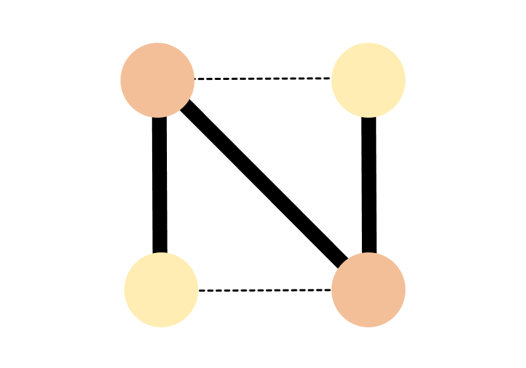

# NeuroConnect  
### 3D Brain Visualization & Comparison Tool 

NeuroConnect is an interactive neuroimaging visualization app built using **Shiny for Python** and **Plotly 3D**, designed to help researchers visualize and compare node-level brain representations.  
The tool supports:

- 3D *glass brain* rendering (ellipsoid or MNI surface)
- Overlaying nodes from healthy vs. diseased brains
- Visualizing differences across conditions (e.g., Alzheimer’s vs. healthy)
- Uploading **custom coordinate datasets**
- Displaying **node-level connections (edges)**
- Highlighting regions of interest (AOI) using a 3D sphere
- Comparing spatial and value-based differences in side-by-side and differential modes

This repository also includes **unit tests**, **CI workflows**, and **documentation scaffolding** following software engineering best practices.

---

## Intended Audience

NeuroConnect is designed for:

- **Neuroscientists** studying structural or functional node-level changes.
- **Students & researchers** learning neuroimaging visualization techniques.
- **Clinicians or analysts** interested in brain-region comparison tools for presentation purposes.

The app requires **no specialized neuroimaging software** and works with simple CSV files.

---

##️ Installation

Clone the repository:

```bash
git clone https://github.com/tinajzhao/NeuroConnect
cd NeuroConnect
```

### 1. Create a virtual environment (recommended)

```bash
python3 -m venv venv
source venv/bin/activate   # macOS / Linux
venv\Scripts\activate     # Windows
```

### 2. Install dependencies

```bash
pip install -r requirements_shiny_neuroconnect.txt
```

To enable realistic MNI brain surface rendering (optional):

```bash
pip install nibabel templateflow scikit-image
```


---

## Running the Application

Run locally:

```bash
shiny run --reload neuroconnect_app.py
```

You can then load:

- Healthy vs. Sick datasets  
- Demo datasets  
- Region-of-interest and edge options  
- Side-by-side or differential visualizations  

---

## Example Usage

### **Minimum CSV format**

Your dataset must contain:

| x (mm) | y (mm) | z (mm) | diagnosis | metric value |
|-------|-------|-------|----|-------|
| 12.4 | -33.2 | 18.0 | CT/AD | 0.42 |

Required: `x`, `y`, `z`, `diagnosis`, `etric value`  
Optional: `id`

### Demo Mode

Inside the Shiny sidebar, click:

- **Use demo (Healthy)**
- **Use demo (Sick)**
- **Render / Update**

---

## Team Members & Contributions

| Team Member | Department | Role | Contributions |
|-------------|------|---------------|----------------|
| **Tina Zhao** | Psychology | Lead Developer | PLEASE ADD CONTRIBUTION |
| **Carlos Pineda** | Pharmacy | Developer | Shiny UI design, node comparison engine, unit test for visualization |
| **Hongyu Mu** | Statistics | Developer | Revise shiny code using real data, writing tests for data loading and summary statistics |
| **Kenny Yi** | Biomedical Informatics and Medical Education | Developer | PLEASE ADD CONTRIBUTION |

---

## Repository Structure

```
NeuroConnect/
│── neuroconnect_app.py
│── requirements.txt
│── README.md
|── LICENSE
|── pyproject.toml
│── tests/
│── .github/workflows/
│── docs/
|── data/
|── src/neuroconnect/
```

---

## Support

Please open **Issues** or **Pull Requests** on GitHub for feedback or contributions.
